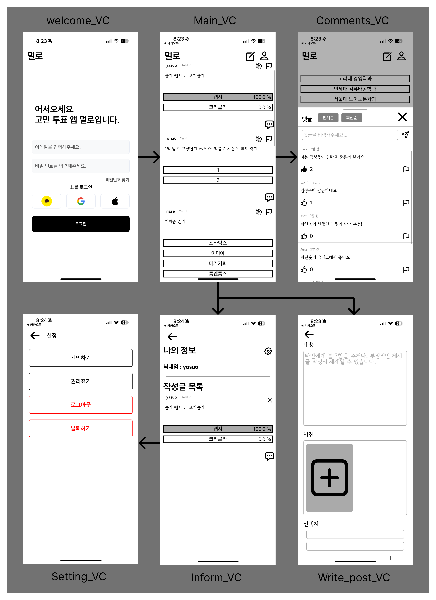
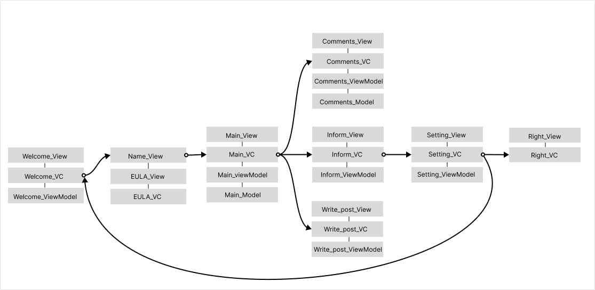

<h1>어플리케이션 Mullo</h1>
<h3>&#8226; 고민 투표 어플리케이션</h3>
<body> 
    <h3>전체구성</h3>
    
    <ul>
        <li>로그인 화면</li>
        <li>메인 화면</li>
        <li>댓글 화면</li>
        <li>설정 화면</li>
        <li>유저정보 화면</li>
        <li>게시글 작성 화면</li>
    </ul>
    

    <h3>사용된 기술</h3>
      
MVVM, Code-Base UI, UIKit, snapKit, realmDB, Alamofire, aws EC2, Flask, Figma

    <h3>새로 사용한 기술과 이유</h3>
    <ul>
        <li><b>RxSwift</b> : Collection view에서 데이터 바인딩할때 복잡도가 너무 올라가 사용</li>
        <li><b>amazon S3</b> : 게시글에 이미지를 넣기위해 사용</li>
        <li><b>Firebase Auth</b> : 이메일로 로그인, 회원가입하기 위해 사용</li>
        <li><b>Kingfisher</b> : 게시글 이미지를 효율적으로 게시하기 위해 사용</li>
    </ul>
    

    <h3>주요 코드 구성 설명</h3>
    
    <h5>Main VC 중심으로 코드를 구성</h5>
    
    <h5>1 : aws S3에 저장된 이미지의 url을 kingFisher를 통해 제공함</h5>
	<h5>2 : '5:2:1' 이런 식의 문자열 데이터를 서버에게 받아 파싱하여 사용, 게시글 투표 여부를 realmDB에 저장하여 게시글 로드 또는 투표시 반영하였음</h5>
	
	<h5>1 : Write_post_VM에서 Rxswift의 Observable한 UIImage 배열을 사용하여 collection view와 데이터 바인딩을 하여 이미지들을 구성한다. 사용자가 이미지 추가 셀을 클릭하면, 권한 허용을 체크하고 PHPicker를 사용하여 VM에 이미지를 추가한다. 이미지가 추가된 VM에서 RxSwift의 데이터 바인딩으로 셀이 추가되어 화면에 표시된다.</h5>
    
	<h5>1 : overCurrentContext 속성으로 comment VC를 추가하여 뒷배경이 보이는 화면을 구성, UIPanGesture를 사용하여 grabBar를 움직이면 comments 뷰의 높이를 변경해 동적인 사용자 경험을 주었음.</h5>
	<h5>2 : 댓글마다 번호를 부여하여 좋아요를 클릭시 realm DB에 해당 번호를 저장하여 좋아요 누른 댓글을 표시한다. 서버에서 댓글 번호를 일정 크기마다 파티클로 나누어 탐색 속도를 높였음.</h5>
</body>
